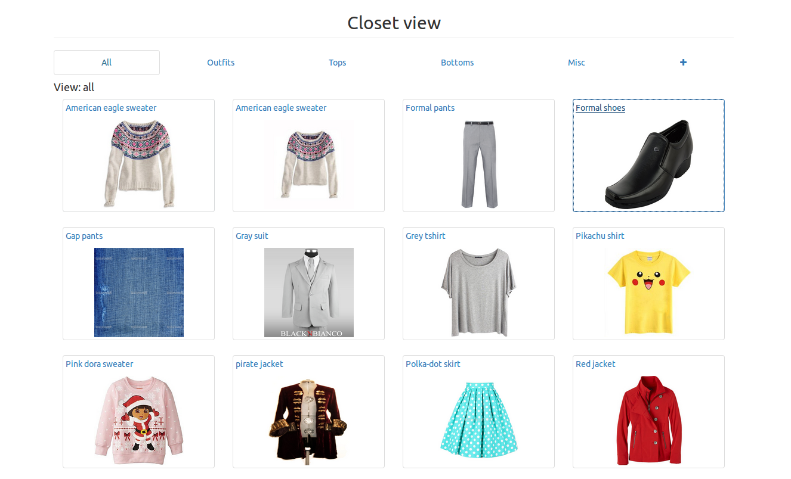
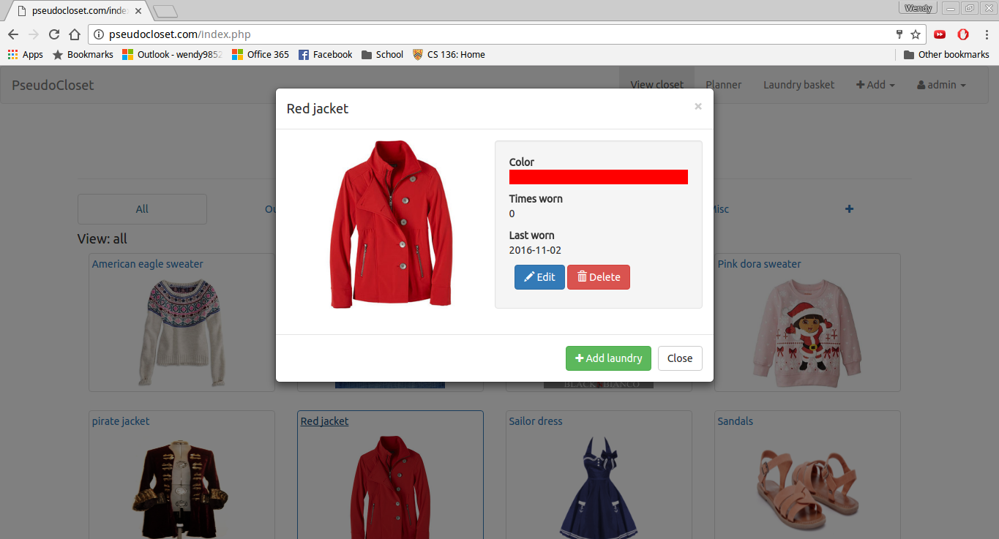
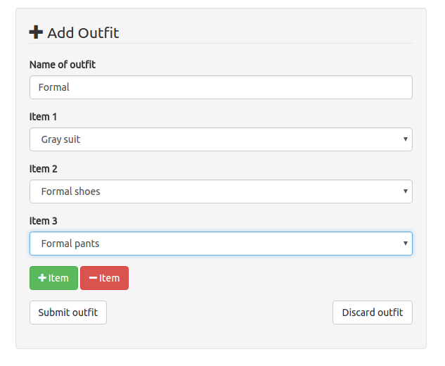

# pseudocloset.com
## About
Ever had that moment when you stare blankly into your closet and can't figure out what to wear? Well worry no more because you have found just the right place for all your problems...
Keep track of your clothing in this interactive virtual wardrobe created using HTML, CSS, PHP, MySQL and Javascript.
Developed and tested using the LAMP(Linux, Apache, MySQL, PHP) stack on localhost
## Features
- Add, delete, edit items of clothing that you want to keep track of
- Group together items of clothings to make a outfit
- Plan the clothes you want to wear ahead of time and pseudoCloset will remind you on the day
- Keeps track of the clothes you wore and automatically adds them to your laundry basket when they're due for a wash
- View large collection of items in a carousel to avoid scrolling

## Screenshots

#### Laundry Alerts - alerts you when your clothes are getting dirty

