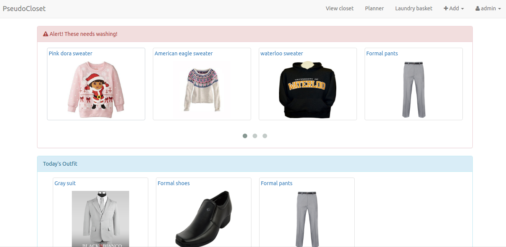
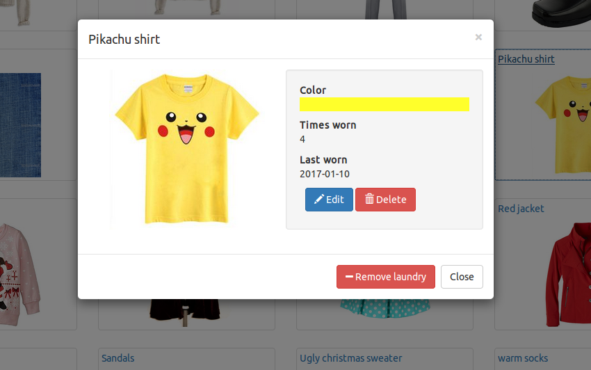
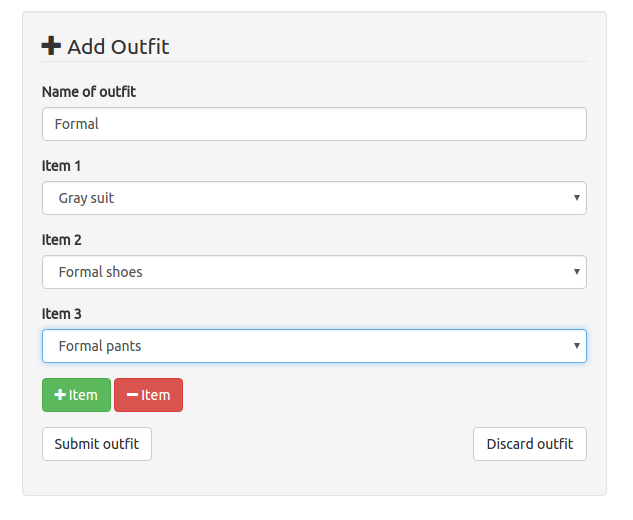

# pseudocloset
**PseudoCloset** is a web application that was developed using LAMP(Linux, Apache, MySQL, PHP) Stack, HTML/CSS, and Javascript. It features an interactive virtual wardrobe where users can keep track of the contents of their closet.

## Features
- Add, delete, edit items of clothing that you want to keep track of
- Group together items of clothings to make a outfit
- Plan the clothes you want to wear ahead of time and pseudoCloset will remind you on the day
- Keeps track of the clothes you wore and automatically adds them to your laundry basket when they're due for a wash
- View large collection of items in a carousel to avoid scrolling

### Laundry Alerts
You are alerted when your clothes are getting dirty. You can then add them to the virtual laundry basket, wash them, and render them wearable once more. 

### Clothing View
You can view each individual item of clothing that you own, or browse by category. You will also receive statistical data such as the number of times the item has been worn, or how old it is. We wouldn't want some items of clothing to feel left out.

### Closet View
Not only can you view individual items, you can also create and view collections. These collections are outfit combos that you have planned to wear to wear and grouped together ahead of time.

### Personalize
Feel free to personalize, edit, and delete outfit, and clothing items whenever you want. 

